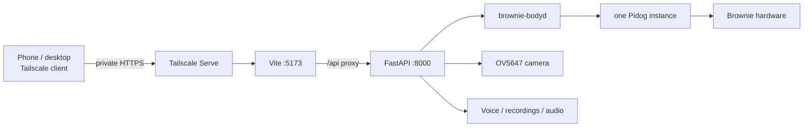

# Brownie — Secure Remote Control v1 Milestone

**Date:** 2026-09-05  
**Branch:** `feature/web-control`  
**Related status:** `architecture/web-control-engineering-status.md`

## Milestone reached

Brownie's web control stack has reached **Secure Remote Control v1**.

The following were validated end-to-end on the real system:

- Brownie UI loads over private Tailscale HTTPS at `https://brownie.tail537e63.ts.net/`.
- Desktop access over the tailnet works and reports Brownie Online.
- Phone access over the tailnet works.
- Camera LIVE works from the phone over the secure remote path.
- Manual-control acquire/release still works remotely.
- A real posture command (Sit/Stand) works remotely from the phone.
- `tailscale status` shows Brownie and the client devices connected.
- Vite explicitly allows `brownie.tail537e63.ts.net` rather than accepting arbitrary Host headers.

This closes the day's connectivity milestone. Tailscale Serve is currently proxying the Vite development server; production static hosting remains a later task.

## Validated stack at end of day

Validated product areas at this checkpoint:

- responsive Control / Camera / Voice / Actions / Tune / Settings shell;
- CPU, temperature, battery, pose, and on-demand distance telemetry;
- camera LIVE at 720p / 15 fps;
- autonomous-by-default manual lease;
- Stand / Sit / Lie / STOP;
- BODY D-pad + movement speed;
- RGB loading pattern;
- Default Sounds playback on Brownie and browser;
- Brownie microphone Record / Stop with 3-minute hard cap;
- Recent / Saved recording library;
- recording playback on browser and Brownie;
- secure Tailscale HTTPS access from desktop and phone.

## Tomorrow — recommended pipeline

Work in this order, one item at a time:

1. **This-device microphone**
   - use the now-working HTTPS origin;
   - `getUserMedia()` + MediaRecorder;
   - explicit Record / Stop;
   - 3-minute cap;
   - upload into the same Recent/Saved library;
   - play on this device / Brownie;
   - preserve source label as `This device microphone`.

2. **HEAD D-pad**
   - inspect/verify upstream yaw/pitch signs first;
   - add bounded head state;
   - require Manual lease;
   - test each direction individually on Brownie.

3. **Real Brownie activity state**
   - derive actual Hermes/controller lifecycle events;
   - target: `Idle -> Listening -> Thinking -> Talking -> Idle`;
   - later add expressive states such as Happy/Shy/Angry;
   - do not fake state with UI timers.

4. **Tune persistence**
   - connect Hermes silence duration/threshold to real config;
   - make speaker volume real/persistent;
   - preserve the already-live movement speed behavior.

5. **Productionize app serving/connectivity**
   - stop depending on manually started Vite for normal Brownie use;
   - build static frontend;
   - run frontend/API as managed services;
   - keep private Tailscale HTTPS access;
   - decide startup/reboot behavior.

6. **Legacy behavior audit/migration**
   - inventory direct SunFounder behavior launchers;
   - migrate robot-affecting behavior behind the central owner;
   - only after this can Manual mode claim global physical arbitration.

## Deferred / later

- shared camera broadcaster for multiple viewers + autonomous CV;
- first-attach controller refactor so socket/STOP remain responsive during initial `Pidog()` construction;
- Wi-Fi/hotspot configuration UI with secure credential handling;
- service worker/offline PWA shell;
- custom Actions/macros after behavior ownership is safe.

## Resume point

Start tomorrow with **This-device microphone**. The secure origin prerequisite is now validated, so no further connectivity work is needed before implementing browser microphone capture.
