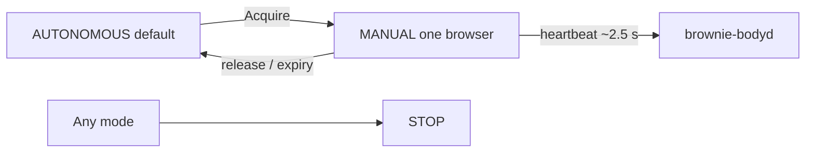
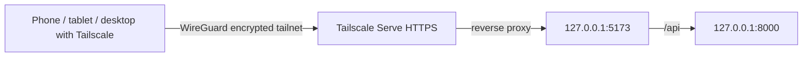

# Brownie Web Control — Engineering Status

**Snapshot:** 2026-09-05  
**Repository:** `josephpranu619/brownie_the_pidog`  
**Branch:** `feature/web-control`  
**Robot:** SunFounder PiDog V2 (“Brownie”) on Raspberry Pi 4 / Ubuntu 22.04 / ROS 2 Humble

This document records the implementation that has actually been built and validated for Brownie's personal web/PWA control interface. It is deliberately distinct from future-looking product ideas: items marked **validated** have been exercised on the real robot or browser; items marked **pending** are not yet complete.

---

## 1. Product goal

Brownie's web app is intended to be a private, lightweight control and observation surface that works from phone, tablet, and desktop while keeping the Raspberry Pi focused on robotics.

Core principles:

- browser/device renders React UI and animations;
- Raspberry Pi serves a lightweight API and robot data;
- one process owns the PiDog hardware interface;
- manual web control is explicit and temporary;
- Brownie remains autonomous by default;
- camera viewing does not require manual motion authority;
- hardware commands are validated backend-side rather than trusted to the browser;
- expensive features such as camera encoding, CV, AI, and audio processing are measured and introduced incrementally.

---

## 2. Current runtime architecture

```mermaid
flowchart LR
    Browser[Phone / tablet / desktop] -->|HTTP or HTTPS| Vite[Vite dev server :5173]
    Vite -->|/api proxy| FastAPI[FastAPI :8000]
    FastAPI --> BodySock[/tmp/brownie-body.sock]
    BodySock --> Bodyd[brownie-bodyd]
    Bodyd --> Pidog[ONE Pidog() instance]
    Pidog --> Hat[Robot HAT]
    Hat --> Brownie[Brownie]

    FastAPI --> Camera[rpicam-vid / OV5647]
    FastAPI --> Audio[PulseAudio / Robot HAT audio tools]
```

Development currently uses two web processes:

```bash
cd ~/brownie_the_pidog
app/backend/.venv/bin/uvicorn main:app --app-dir app/backend --host 0.0.0.0 --port 8000
```

```bash
cd ~/brownie_the_pidog/app/frontend
npm run dev -- --host
```

LAN development URL:

```text
http://10.0.0.180:5173/
```

The long-term production target remains a compiled static frontend plus the lightweight API, so Vite/Node do not need to remain active merely to render the UI.

---

## 3. Single hardware-owner rule

`tools/brownie-bodyd` is the persistent body controller and the sole intended owner of the `Pidog()` instance.

```mermaid
flowchart LR
    Web[Web / PWA] --> Controller[Brownie control layer]
    Voice[Voice / Hermes] --> Controller
    AI[AI behavior] --> Controller
    ROS[ROS 2] --> Controller
    Controller --> Pidog[ONE Pidog() instance]
    Pidog --> Hardware[Robot HAT / servos / sensors]
```

Current body controller details:

- Unix socket: `/tmp/brownie-body.sock`
- user service: `brownie-bodyd.service`
- socket permissions: `0600`
- starts in passive mode;
- does not initialize PiDog hardware until a posture/body command requires it;
- preserves posture on shutdown rather than calling the upstream close path that lies the dog down;
- default control mode is autonomous.

### Known first-attach safety limitation

The first `Pidog()` construction takes roughly eight seconds on this system. `brownie-bodyd` is currently single-threaded, so while that first hardware attach is occurring it cannot service socket commands, heartbeat, distance, status, or web STOP.

After initialization, commands are nonblocking enough for normal STOP handling.

**Implication:** the physical power switch remains the emergency stop during the initial hardware-attach window. A future controller refactor should separate hardware initialization from socket serving/motion execution if a hard software STOP guarantee is required during attach.

---

## 4. Frontend / PWA status

Frontend stack:

- React
- Vite
- dark charcoal/navy UI with warm amber accent
- responsive phone/tablet/desktop layout
- PWA manifest + icon metadata
- no service worker/offline cache yet

Current persistent tabs:

```text
Control | Camera | Voice | Actions | Tune | Settings
```

### Current secure development host

Tailscale Serve has been enabled for Brownie and exposes the Vite development server privately to the tailnet at:

```text
https://brownie.tail537e63.ts.net/
```

Vite explicitly allows only this tailnet host in `server.allowedHosts` rather than allowing arbitrary Host headers.

This HTTPS origin is important for secure browser APIs such as `getUserMedia()` and later PWA/service-worker behavior.

---

## 5. Telemetry — validated

The Control screen uses different polling rates based on cost and usefulness.

```mermaid
flowchart TD
    UI[Control telemetry]
    UI --> System[/api/system ~2 s]
    UI --> Robot[/api/status ~30 s]
    UI --> Distance[/api/distance ~1 s only while enabled]

    System --> CPU[CPU usage /proc/stat]
    System --> Temp[CPU temperature]
    Robot --> Battery[Battery voltage + estimated percent]
    Robot --> Pose[Controller pose]
    Distance --> Ultrasonic[Ultrasonic sensor]
```

Validated telemetry:

- Brownie online/offline state;
- CPU usage;
- CPU temperature;
- battery voltage;
- estimated battery percentage;
- current known pose;
- on-demand ultrasonic distance.

Battery percentage uses voltage interpolation rather than pretending to be a calibrated fuel gauge. Voltage remains visible.

Distance is demand-driven:

- starts OFF;
- no ultrasonic polling while OFF;
- roughly one reading per second while ON;
- keeps the last reading when paused.

Robot sensor reads continue to follow the single-owner rule through `brownie-bodyd`.

---

## 6. Camera — validated

Hardware:

- OV5647 5 MP camera
- `rpicam-vid`
- 1280×720
- 15 fps
- MJPEG

Flow:

```mermaid
flowchart LR
    Live[Camera LIVE] --> API[/api/camera/stream]
    API --> Encoder[one rpicam-vid process]
    Encoder --> Camera[OV5647]
    Off[Camera OFF / disconnect] --> Stop[terminate encoder]
```

Validated behavior:

- camera process starts only on demand;
- repeated on/off toggling works;
- camera works independently of manual/autonomous motion mode;
- desktop and phone viewing were exercised.

Known limitation:

- current implementation effectively supports one active live viewer;
- a second viewer can replace/freeze the first stream.

Future target: one camera producer with broadcast/fan-out, especially before autonomous CV and browser viewing share the camera.

---

## 7. Manual vs autonomous authority — validated

Brownie stays **AUTONOMOUS** by default. Opening the app does not grant servo authority.

Manual control uses a short backend/bodyd lease:



Lease behavior:

- eight-second lease;
- browser heartbeat about every 2.5 seconds;
- one browser owner at a time;
- second browser cannot steal the lease;
- release returns control to autonomous;
- tab close/network loss/backend failure causes logical expiry;
- lease is in-memory only;
- bodyd restart resets to autonomous.

Validated from desktop and phone:

- acquire;
- “in use” on another device;
- release;
- expiry after tab close.

### Important arbitration limitation

Some legacy SunFounder behaviors are still launched directly by `tools/brownie-behaviors` and may instantiate/control PiDog independently. Until these behavior producers are migrated behind the central control layer, the web manual lease cannot truthfully guarantee physical suppression of every legacy autonomous behavior.

Long-term requirement: all motion producers — web, Hermes/AI, ROS, and legacy behaviors — must route through the same controller before manual/autonomous arbitration is globally authoritative.

---

## 8. Posture and manual body motion — validated

Validated posture controls:

- Stand
- Sit
- Lie
- STOP

Stand/Sit/Lie require the active manual lease. STOP remains available outside Manual mode.

Validated BODY D-pad:

- forward
- backward
- turn left
- turn right

Current design intentionally uses one discrete gait action per tap rather than press-and-hold continuous walking.

Rules:

- Manual lease required;
- Brownie must already be standing;
- no automatic stand before gait;
- movement speed is passed to the controller;
- STOP remains available.

Movement Speed in Tune is live for BODY D-pad and currently ranges 30–100 with default 80.

**Pending:** HEAD D-pad. Upstream yaw/pitch coordinate signs must be confirmed before mapping arrows; do not guess.

---

## 9. Tune screen

Current Tune sections:

- Voice Silence Duration: 0.5–6.0 s, default 3.0
- Voice Silence Threshold: 500–4000, default 1800
- Speaker Volume: 0–100, default 60
- Movement Speed: 30–100, default 80

Current implementation state:

- Movement Speed is live for web BODY D-pad.
- WakeUp/Hermes silence values are UI state only for now.
- Speaker Volume tuning value is not yet the persistent global Robot HAT volume authority.

Future work should inspect Hermes config persistence and Robot HAT volume persistence before connecting these controls.

---

## 10. Hardware I/O primitives — validated

Three primitives were individually tested against real Brownie hardware.

### Speaker

Validated default sound playback through Robot HAT.

FastAPI runs in its own virtualenv, while the working `robot_hat` package belongs to system Python. `app/backend/robot_hat.py` is a minimal bridge that invokes `/usr/bin/python3` rather than duplicating hardware/audio dependencies inside the web venv.

### Microphone

Validated capture from PulseAudio source:

```text
brownie_mic_boosted
```

This is the default source initialized by `brownie-mic.service`, allowing the web workflow to coexist with Brownie's existing PulseAudio/Hermes environment instead of opening raw ALSA capture directly.

### RGB LED

Validated cyan loading/listen animation through `brownie-bodyd` after PiDog hardware has been initialized.

LED commands require body hardware initialization. If bodyd is still passive after a restart, the backend correctly returns a conflict rather than pretending the RGB strip is available.

---

## 11. Voice tab / audio center — validated Brownie-side workflow

Voice was separated from Control so Control remains focused on movement, state, and quick physical robot control.

Current Voice layout:

```text
Speaker
  Source: Default Sounds | Recordings
  Selection
  Brownie speaker volume
  Play on Brownie | Play on this device

Microphone
  Brownie microphone | This device microphone
  Record / Stop

Recordings
  Recent
  Saved
```

### Default Sounds — validated

The UI enumerates the actual files in `~/pidog/sounds`; filenames are not hard-coded.

Actions:

- play on Brownie;
- play on this browser/device.

### Brownie microphone recording — validated

Recording is no longer fixed at five seconds.

Current behavior:

- press Record to start;
- UI changes to Stop and shows elapsed time;
- press Stop to finish;
- server enforces a hard three-minute cap;
- recording process lives on Brownie, not in the browser;
- leaving the Voice tab does not create an unlimited runaway recording;
- completed recording is added to Recent.

Format:

- WAV
- 48 kHz
- 16-bit
- stereo capture

### Recording library — validated

Persistent application-managed storage:

```text
~/.local/share/brownie/recordings/
├── recent/
└── saved/
```

Recent policy:

- maximum 10 files **or** 100 MB;
- oldest unsaved files are pruned when limits are exceeded.

Saved policy:

- Keep moves a Recent recording to Saved;
- Saved clips are not auto-deleted.

Each row exposes:

- source label (Brownie microphone / future device microphone);
- duration when detectable;
- file size;
- play on this device;
- play on Brownie;
- Keep;
- Delete.

Recording IDs are application-managed identifiers rather than arbitrary filesystem paths.

### Brownie playback of recorded WAV — validated

Browser playback of WAV worked directly, but direct `aplay -D plughw:1,0` initially failed with:

```text
Device or resource busy
```

Cause: PulseAudio/Hermes held the Robot HAT device.

Brownie's existing diagnostic already established the correct safe direct-playback recipe, so Voice playback now uses:

```text
sox -> mono/normalize -> pasuspender -- aplay -D plughw:1,0
```

`pasuspender` temporarily releases PulseAudio's ownership for the manual playback operation and restores it afterward.

The backend performs a short startup-failure check so ALSA errors return as real HTTP failures rather than false “playing” success.

### This-device microphone — pending

The UI contains a `This device microphone` source, but browser recording/upload is not yet implemented.

This feature should use `navigator.mediaDevices.getUserMedia()` + MediaRecorder and then upload the completed clip to Brownie's managed recording library.

A trusted HTTPS origin is required for reliable mobile browser microphone access, which is one of the reasons the Tailscale HTTPS milestone is being completed before this feature.

---

## 12. Hermes / audio coexistence

Brownie currently uses user services including:

- `brownie-mic.service`
- Hermes CLI service
- `brownie-bodyd.service`

`brownie-mic.service` initializes speaker support and a PulseAudio source named `brownie_mic_boosted`, then makes it the default source.

Audio design rule:

- prefer PulseAudio coexistence for microphone capture;
- use `pasuspender` only for short direct Robot HAT playback that requires exclusive ALSA access;
- future autonomous speaking/playback should publish activity state so wake detection/echo handling can be coordinated rather than relying on accidental contention.

---

## 13. Tailscale / secure remote connectivity — in progress

Brownie is connected to a Tailscale tailnet.

Current Brownie Tailscale IPv4:

```text
100.96.236.120
```

Tailscale Serve currently exposes Vite privately as:

```text
https://brownie.tail537e63.ts.net/
```

Development flow:



This HTTPS endpoint is **tailnet-private**; use Tailscale Serve, not Funnel, for Brownie's personal control app.

Current Vite config explicitly permits:

```text
brownie.tail537e63.ts.net
```

Next connectivity tests:

1. pull the Vite allowlist change;
2. restart Vite;
3. verify desktop app loads over the HTTPS tailnet hostname;
4. add tablet/desktop Tailscale clients and sign into the same tailnet;
5. reconnect the phone Tailscale client;
6. verify telemetry and API proxy through HTTPS;
7. implement browser/device microphone capture.

A Tailscale health warning currently notes that subnet routing is enabled while Linux IP forwarding is disabled. This does not block the current Brownie Serve use case. It only matters if Brownie is intentionally meant to route an external subnet through itself.

---

## 14. Why Tailscale is a strong fit for Brownie

For this personal robot, the useful property is that Brownie, phone, tablet, and desktop behave like machines on one private network even when they are on different Wi-Fi networks or mobile data.

Tailscale provides:

- WireGuard-based encrypted peer connectivity;
- NAT traversal;
- stable private machine identities/IPs;
- tailnet DNS names;
- access controls;
- private HTTPS reverse proxying with Serve;
- no need to expose Brownie's FastAPI/Vite ports to the public internet.

That directly matches Brownie's needs: private app access, secure browser APIs, and connectivity while travelling or using a phone hotspot.

Teleport is a different class of product. It is an identity-aware access platform aimed primarily at managed infrastructure access such as SSH, Kubernetes, databases, desktops, and protected applications, with RBAC, short-lived credentials, proxy services, and audit logging. Those are valuable for organizations, but they add substantially more control-plane/identity infrastructure than this single personal robot needs.

For Brownie, Tailscale is the simpler networking primitive; Teleport would make more sense if the project later became a multi-user infrastructure environment requiring centralized privileged-access governance and detailed audit controls.

---

## 15. Known architectural debts / limitations

### Legacy behavior ownership

`tools/brownie-behaviors` still launches several upstream SunFounder scripts directly. Those scripts can violate the one-PiDog-owner model.

Before claiming globally safe manual/autonomous arbitration, migrate behavior implementations behind the central controller.

### Camera sharing

One current web camera producer/viewer path is not sufficient for simultaneous browser viewers + autonomous CV.

Future: one camera service / broadcaster.

### First PiDog attach

Single-threaded first hardware construction blocks socket servicing for roughly eight seconds.

Future: separate attach/motion worker from socket listener.

### Head control

Not implemented. Coordinate direction must be validated first.

### Activity state

Current pose is real, but higher-level activity such as:

```text
Idle -> Listening -> Thinking -> Talking -> Idle
```

and expressive states (Happy, Shy, Angry, etc.) are not yet event-driven in the UI.

Future work should derive activity from actual Hermes/controller lifecycle events, not fake timers.

### PWA production mode

Manifest exists, but there is no service worker/offline shell yet. Development still uses Vite.

### Settings/network UX

The app does not yet configure Wi-Fi credentials or Tailscale from the browser. Any future network-management UI must avoid exposing an unauthenticated shell or plaintext credential endpoint.

---

## 16. Current milestone matrix

| Area | Status | Notes |
|---|---|---|
| React responsive UI | ✅ Validated | Phone + desktop |
| PWA manifest/icon | ✅ Scaffolded | Service worker pending |
| FastAPI backend | ✅ Validated | Dev API on :8000 |
| CPU/temp telemetry | ✅ Validated | ~2 s refresh |
| Battery/pose telemetry | ✅ Validated | ~30 s refresh |
| Ultrasonic distance | ✅ Validated | On-demand |
| Camera stream | ✅ Validated | 720p/15 fps, one viewer limitation |
| Manual lease | ✅ Validated | 8 s, one owner |
| Stand/Sit/Lie/STOP | ✅ Validated | Real robot |
| BODY D-pad | ✅ Validated | Four directions |
| Movement speed | ✅ Live | Web body movement |
| HEAD D-pad | ⏳ Pending | Direction mapping validation |
| LED loading pattern | ✅ Validated | Requires initialized body hardware |
| Default sound playback | ✅ Validated | Brownie + browser |
| Brownie mic record/stop | ✅ Validated | 3 min cap |
| Recording Recent/Saved | ✅ Validated | Keep/Delete/preview/play |
| Recorded WAV -> Brownie | ✅ Validated | `pasuspender` playback path |
| This-device mic | ⏳ Pending | Requires HTTPS + upload workflow |
| Tailscale HTTPS | 🟡 In progress | Serve live; Vite host allowlist committed |
| Hermes activity state | ⏳ Pending | Event-driven integration needed |
| Tune persistence | ⏳ Pending | Except movement speed |
| Wi-Fi/Tailscale Settings UX | ⏳ Pending | Security design required |
| Legacy behavior migration | ⏳ Pending | Needed for global arbitration |

---

## 17. Near-term roadmap

Recommended order from the current state:

1. Validate the new Tailscale HTTPS host end-to-end on desktop.
2. Add/reconnect phone, tablet, and desktop to the tailnet.
3. Implement `This device microphone` via browser MediaRecorder + upload.
4. Add real HEAD D-pad control after coordinate validation.
5. Add event-driven Brownie activity state from Hermes/controller lifecycle.
6. Connect/persist Tune values safely.
7. Design Settings connectivity UX for IP/Tailscale/Wi-Fi/hotspot use.
8. Inventory and migrate legacy behaviors behind the central hardware owner.
9. Replace development Vite serving with production static PWA hosting.
10. Revisit camera fan-out / autonomous vision ownership.

---

## 18. Engineering rule going forward

Every new robot-affecting feature should be validated in this order:

```text
primitive -> backend authority -> API -> UI -> real-hardware test -> document result
```

Do not mark a feature “working” because the UI renders or an endpoint returns HTTP 200. A hardware feature is only validated when the expected physical effect has been observed on Brownie and the failure path is understood.
