# Brownie Web Control Architecture

> **Current implementation snapshot:** see [`architecture/web-control-engineering-status.md`](./web-control-engineering-status.md) for the validated 2026-09-05 engineering state, including telemetry, camera, manual lease, posture/body motion, Voice/recordings, audio arbitration, LED, and Tailscale HTTPS. This document remains the longer-form architecture/design rationale.

This document is the living architecture record for Brownie's custom web/PWA control interface.

The goal is a free, locally hosted, fully customizable control app that works from a phone, tablet, or desktop browser without making the Raspberry Pi 4 spend significant resources rendering the UI.

## Current development strategy

Build and validate the user interface first with simulated data and no robot hardware connection. Only after the UI feels worth keeping will it be connected to Brownie's existing control layer.

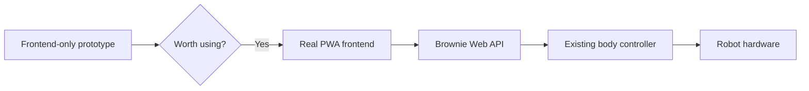

This keeps early experimentation completely isolated from servo control and avoids spending time on backend integration before the product direction is validated.

The React frontend is now scaffolded under `app/frontend/` and has been successfully served by Brownie's Raspberry Pi 4 to another device on the same Wi-Fi network.

## Development vs production hosting

During development, Vite runs on Brownie and serves the React source with hot reload. The UI is reachable from another device on Brownie's LAN address.

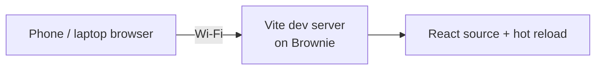

This development server is temporary tooling, not the intended production runtime.

### Development runtime: two servers

Once the frontend starts reading real Brownie data, development uses two separate processes at the same time:

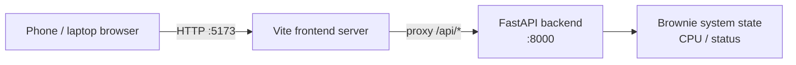

Vite is the development server for the app the user sees. FastAPI is the backend that exposes Brownie's real data and will later mediate robot-control requests. The Vite development proxy forwards `/api/*` requests to FastAPI at `127.0.0.1:8000`, so the browser can continue talking only to the frontend origin on port 5173.

During development, **both processes must be running**. If Vite is stopped, the app on port 5173 is unreachable. If FastAPI is stopped, the UI can still load but API requests fail with a connection-refused proxy error. This two-process arrangement is development-only; production should present a simpler single app endpoint to the user.

For production, the React/PWA source will be compiled into ordinary static web files. Brownie will serve those files with a small static server while the phone or tablet performs the actual UI rendering.

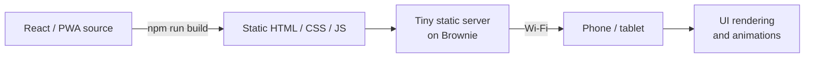

Node.js and the Vite development server therefore do not need to remain active in production merely to render the application.

## PWA and secure-origin model

Brownie's frontend includes a web app manifest, app metadata, theme colors, and app-icon support so it is structurally PWA-ready.

The current LAN development URL uses plain HTTP. That is acceptable for normal frontend development, but production PWA features such as service workers and a reliable install experience should be exposed from a trusted secure origin.

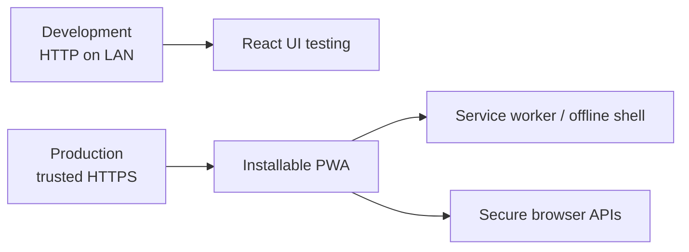

Brownie should therefore keep the simple LAN HTTP workflow for development and add a trusted HTTPS endpoint before the PWA installation/offline phase is considered complete. Tailscale is a natural candidate because Brownie already has a Tailscale network interface, but the final serving method should be chosen and verified separately.

## Target control architecture

Brownie's web interface should not create its own `Pidog()` instance. Instead, all control surfaces should eventually route commands through the existing body controller.

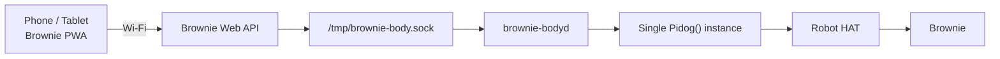

The existing `brownie-bodyd` process remains the single owner of the PiDog hardware interface. This avoids multiple processes competing for servos, GPIO, sensors, and audio resources.

## One hardware owner

Future interfaces such as the PWA, voice control, AI behavior, or ROS 2 should not independently instantiate PiDog hardware control.

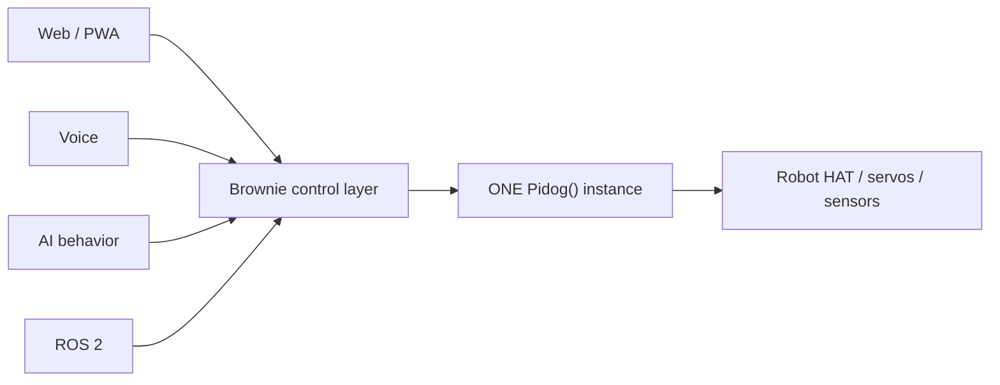

This gives Brownie one place to enforce command priority, movement locking, safe posture transitions, emergency stop behavior, and state tracking.

## Thin-client resource philosophy

The Raspberry Pi should spend its resources on being a robot, not on rendering the application UI.

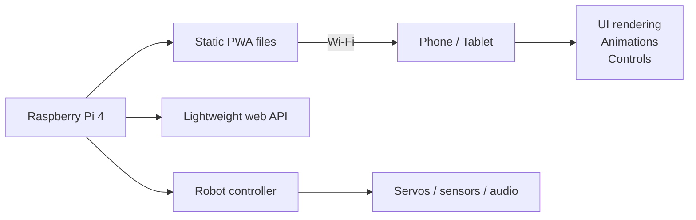

The intended production model is:

- React/PWA source is compiled during development.
- Production UI is served as static HTML/CSS/JavaScript files.
- Node.js does not need to remain running in production just to render the interface.
- The phone or tablet performs UI rendering and animation work.
- Brownie's backend handles small control messages, telemetry, and robot state.

The UI itself should therefore create very little Raspberry Pi load. Higher-cost features such as camera streaming, computer vision, local AI inference, or high-resolution video encoding will be measured separately before being enabled by default.

## Telemetry and sensor polling policy

Telemetry is split by cost and usefulness instead of polling every source at the same rate.

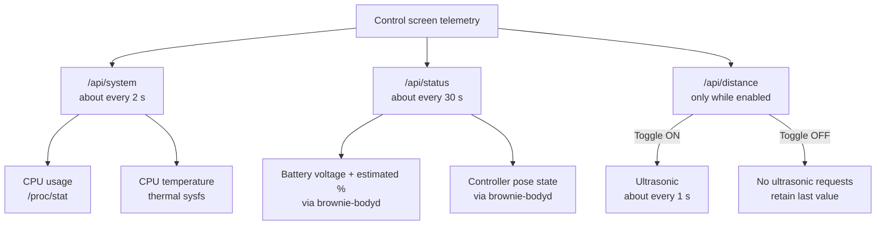

CPU usage and temperature are Linux system reads, not active robot sensors. CPU usage is calculated from changes in `/proc/stat`; the first reading after backend startup may therefore be unavailable until a second sample exists. These reads require no extra Python dependency and no permanent worker thread.

Battery changes slowly, so the web UI refreshes battery/pose status about every 30 seconds rather than tying those Robot HAT/body-controller reads to the faster CPU dashboard. Battery percentage reuses the same voltage-to-estimated-percentage interpolation already used by `tools/brownie`; the underlying measured voltage remains visible because the percentage is an estimate rather than a calibrated fuel gauge.

Ultrasonic distance remains demand-driven. The Control screen starts with distance OFF and displays `--`. Turning it on requests a measurement about once per second. Turning it off stops distance requests entirely and leaves only the last successful reading visible. A backend disconnect/restart clears the browser's distance value back to `--` rather than carrying a stale range reading into a new Brownie session.

Sensor access still follows the one-hardware-owner rule: the web API does not instantiate `Pidog()` or directly own robot GPIO. It asks `brownie-bodyd`, which performs robot hardware reads.

### Ephemeral telemetry and restart behavior

Live telemetry is intentionally not written continuously to disk.

- CPU usage and temperature are freshly measured after restart.
- Battery is freshly measured after restart.
- Distance starts as `--` and remains inactive until explicitly enabled.
- Pose starts as unknown if `brownie-bodyd` cannot safely know the physical posture after a restart.
- Future activity states such as Listening, Thinking, Talking, Happy, Shy, or Angry should also be treated as live event state, not blindly restored after a crash.

If FastAPI stops, the frontend marks Brownie offline when the next system request fails. When the API returns, system and robot telemetry repopulate from fresh reads. Persistent user preferences and custom configuration are a separate concern and may later use a small configuration store; live telemetry should remain ephemeral.

## On-demand camera streaming

The first live-camera milestone uses Brownie's detected OV5647 camera through `rpicam-vid` at 1280x720, 15 fps, MJPEG. The web API starts the encoder only when the browser requests `/api/camera/stream`.

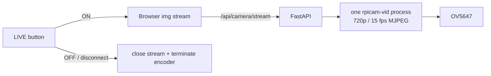

Camera streaming is demand-driven like ultrasonic ranging, but its resource cost is much larger. When LIVE is OFF there should be no `rpicam-vid` encoder process created by the web app. When LIVE is ON, CPU usage, temperature, and battery behavior should be measured using the existing telemetry dashboard.

The current camera prototype has one active encoder/stream owner. If a second browser starts LIVE, it replaces the first stream, so the first viewer freezes. A future shared camera broadcaster should allow multiple viewers to consume the same encoded frames without launching duplicate camera encoders or stealing the stream from one another.

For this milestone FastAPI temporarily owns the camera subprocess because the purpose is to validate streaming and measure its cost. This is not the final autonomous-vision architecture. Once Brownie uses the camera for face tracking, perception, or other autonomous behavior, camera ownership should move to a dedicated controller such as `brownie-camd` so one camera owner can serve both autonomous vision and web viewers without competing for the OV5647 device.

## Autonomous vs manual control authority

Brownie is autonomous by default. Opening the web app does not grant it servo authority. A browser must explicitly acquire a short-lived manual-control lease before manual motion commands are accepted.

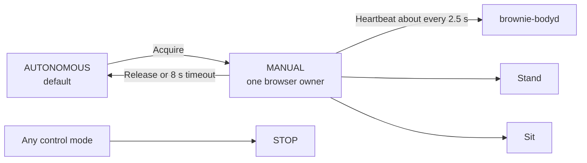

`brownie-bodyd` is the authority for this lease. The lease ID and expiry are held only in memory; there is no watchdog thread and no disk write. The active lease lasts eight seconds and is refreshed by browser heartbeats. If the browser closes, the network disappears, FastAPI dies, or heartbeats otherwise stop, the lease expires naturally and Brownie returns to autonomous mode.

Only one client can own Manual Control at a time. Other browsers may continue viewing telemetry and camera output but cannot take over motion authority until the existing lease is released or expires. FastAPI creates the opaque lease ID and forwards acquire, heartbeat, release, and movement requests to `brownie-bodyd`; the React UI is not trusted as the enforcement boundary.

The first live web-motion milestone deliberately enables only **Stand** and **Sit**, and both commands require the requesting browser's current manual lease. The pose card updates immediately when the controller accepts one of these transitions. **Lie, body D-pad, and head D-pad remain disabled** until they are implemented and tested separately.

The web **STOP** command is always accepted by `brownie-bodyd`, including in autonomous mode, and calls the existing body-stop path without forcing Brownie to lie down. Posture transitions are issued asynchronously so the controller remains available to receive a STOP request while a movement is underway. This STOP is a software body-motion stop through the current single Pidog owner, not a hardware power cut; future autonomous motion sources must also route through the same control authority for the stop guarantee to cover them.

Camera streaming is independent of control authority: camera LIVE may be used in either Autonomous or Manual mode.

## Initial UI direction

The frontend includes or targets:

- on-demand live camera view
- battery, distance, CPU usage/temperature, and pose status
- leased autonomous/manual control mode
- live stand / sit / stop controls
- future lie control
- future body directional control
- future head directional control
- customizable Brownie actions
- Brownie tuning parameters
- mobile bottom navigation

Controls that have not yet been connected to a safe backend authority remain design targets only. Frontend prototyping must not imply that a corresponding hardware command or tuning value is already enabled, applied, or safe.

## App screen structure

The frontend uses five persistent bottom-navigation destinations. The main Control screen stays focused on driving Brownie, while camera-heavy, behavior, tuning, and app-preference features get their own screens so they can evolve independently.

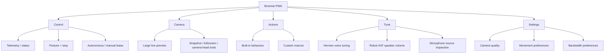

Camera is intentionally separated from Control because video streaming may become one of the larger Raspberry Pi resource consumers. Keeping it as a distinct screen gives Brownie room to use different frame-rate, resolution, or stream-lifecycle policies without complicating the primary movement controller.

Tune is intentionally separated from Settings. Settings describes app behavior and preferences, while Tune is Brownie-specific runtime/hardware configuration. The initial Tune screen mirrors the existing `tools/brownie-tuning` responsibilities: Hermes `voice.silence_duration`, Hermes `voice.silence_threshold`, Robot HAT speaker volume, and microphone-source inspection. The UI must clearly distinguish pending edits from values that have actually been read from or applied to Brownie.

## Safety boundary

The web UI is a command surface, not the hardware authority.

The backend/body-control layer remains responsible for validating commands and preserving Brownie's existing safety rules, including safe posture transitions before walking and preventing competing live PiDog controllers.

## Planned evolution

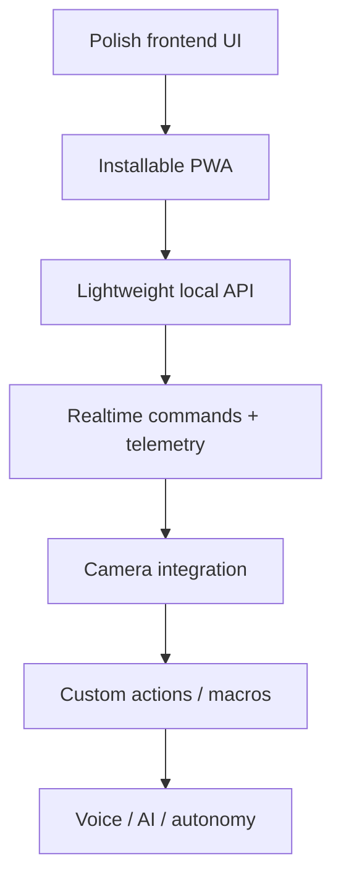

This document should be updated whenever a meaningful web-control architecture decision is made.
