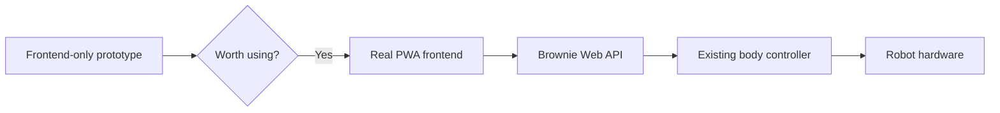
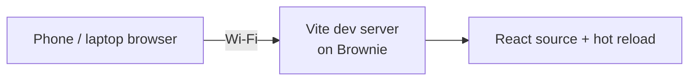
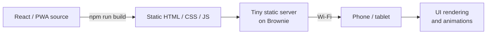
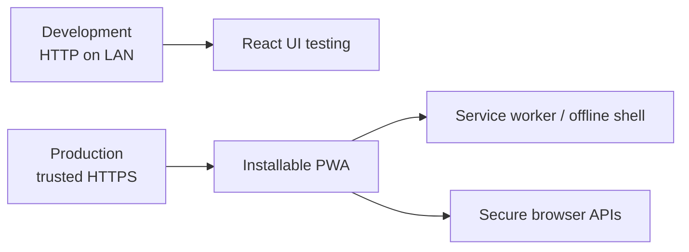
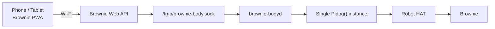
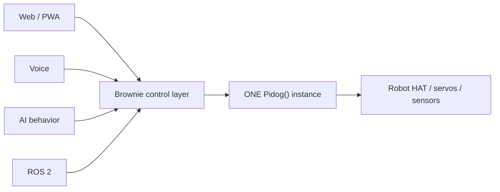
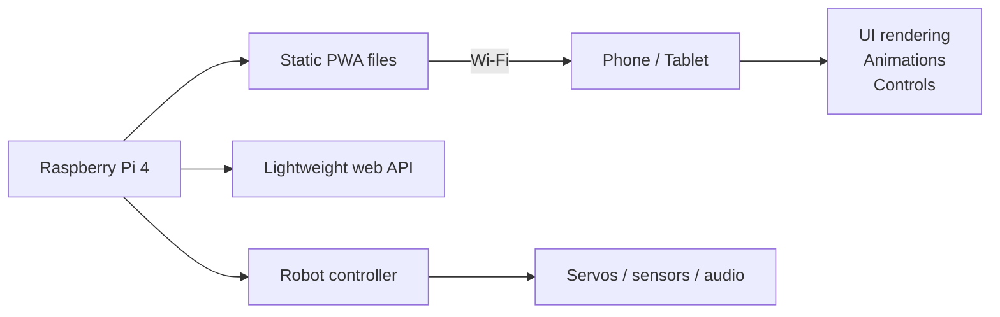
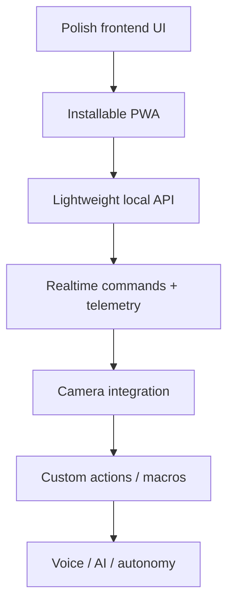

# Brownie Web Control Architecture

This document is the living architecture record for Brownie's custom web/PWA control interface.

The goal is a free, locally hosted, fully customizable control app that works from a phone, tablet, or desktop browser without making the Raspberry Pi 4 spend significant resources rendering the UI.

## Current development strategy

Build and validate the user interface first with simulated data and no robot hardware connection. Only after the UI feels worth keeping will it be connected to Brownie's existing control layer.

This keeps early experimentation completely isolated from servo control and avoids spending time on backend integration before the product direction is validated.

The React frontend is now scaffolded under `app/frontend/` and has been successfully served by Brownie's Raspberry Pi 4 to another device on the same Wi-Fi network.

## Development vs production hosting

During development, Vite runs on Brownie and serves the React source with hot reload. The UI is reachable from another device on Brownie's LAN address.

This development server is temporary tooling, not the intended production runtime.

For production, the React/PWA source will be compiled into ordinary static web files. Brownie will serve those files with a small static server while the phone or tablet performs the actual UI rendering.

Node.js and the Vite development server therefore do not need to remain active in production merely to render the application.

## PWA and secure-origin model

Brownie's frontend includes a web app manifest, app metadata, theme colors, and app-icon support so it is structurally PWA-ready.

The current LAN development URL uses plain HTTP. That is acceptable for normal frontend development, but production PWA features such as service workers and a reliable install experience should be exposed from a trusted secure origin.

Brownie should therefore keep the simple LAN HTTP workflow for development and add a trusted HTTPS endpoint before the PWA installation/offline phase is considered complete. Tailscale is a natural candidate because Brownie already has a Tailscale network interface, but the final serving method should be chosen and verified separately.

## Target control architecture

Brownie's web interface should not create its own `Pidog()` instance. Instead, all control surfaces should eventually route commands through the existing body controller.

The existing `brownie-bodyd` process remains the single owner of the PiDog hardware interface. This avoids multiple processes competing for servos, GPIO, sensors, and audio resources.

## One hardware owner

Future interfaces such as the PWA, voice control, AI behavior, or ROS 2 should not independently instantiate PiDog hardware control.

This gives Brownie one place to enforce command priority, movement locking, safe posture transitions, emergency stop behavior, and state tracking.

## Thin-client resource philosophy

The Raspberry Pi should spend its resources on being a robot, not on rendering the application UI.

The intended production model is:

- React/PWA source is compiled during development.
- Production UI is served as static HTML/CSS/JavaScript files.
- Node.js does not need to remain running in production just to render the interface.
- The phone or tablet performs UI rendering and animation work.
- Brownie's backend handles small control messages, telemetry, and robot state.

The UI itself should therefore create very little Raspberry Pi load. Higher-cost features such as camera streaming, computer vision, local AI inference, or high-resolution video encoding will be measured separately before being enabled by default.

## Initial UI direction

The first frontend prototype includes simulated versions of:

- live camera view
- battery, distance, CPU temperature, and pose status
- stand / sit / lie controls
- emergency stop
- body directional control
- head directional control
- customizable Brownie actions
- mobile bottom navigation

These controls are currently design targets only. Frontend prototyping must not imply that a corresponding hardware command is already enabled or safe.

## Safety boundary

The web UI is a command surface, not the hardware authority.

The backend/body-control layer remains responsible for validating commands and preserving Brownie's existing safety rules, including safe posture transitions before walking and preventing competing live PiDog controllers.

## Planned evolution

This document should be updated whenever a meaningful web-control architecture decision is made.
